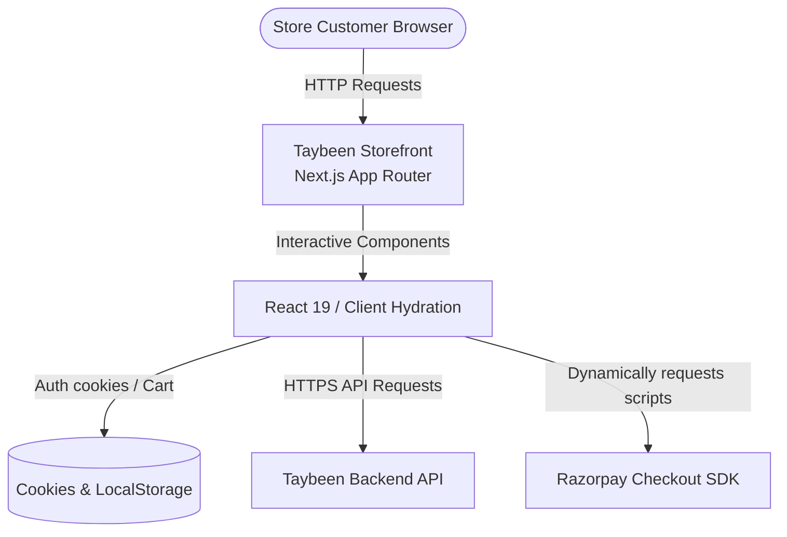
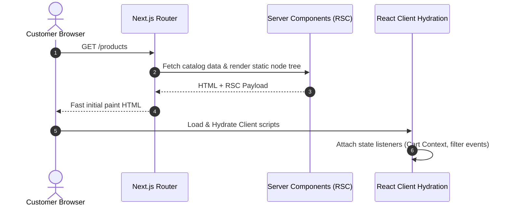
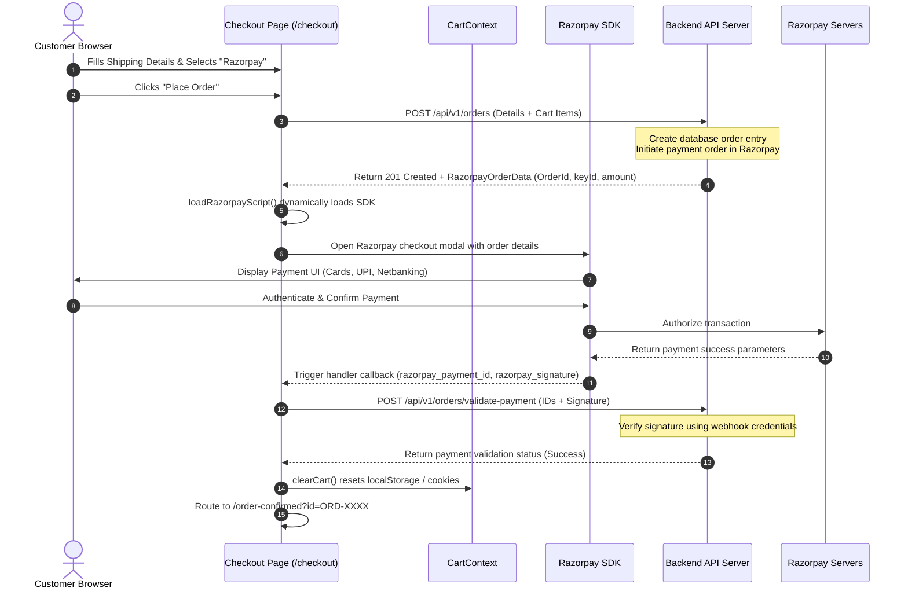
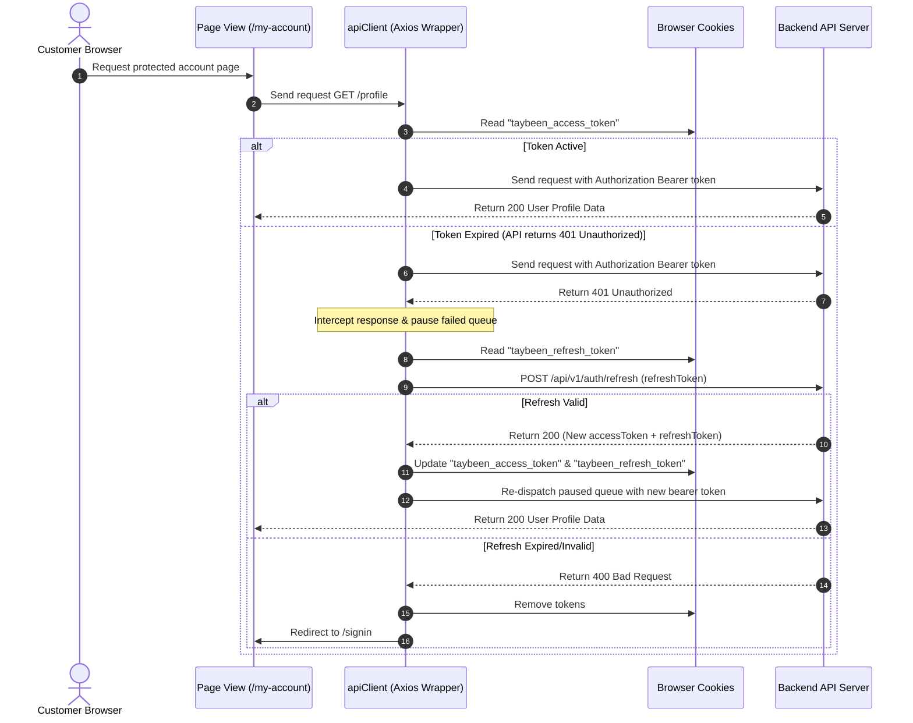
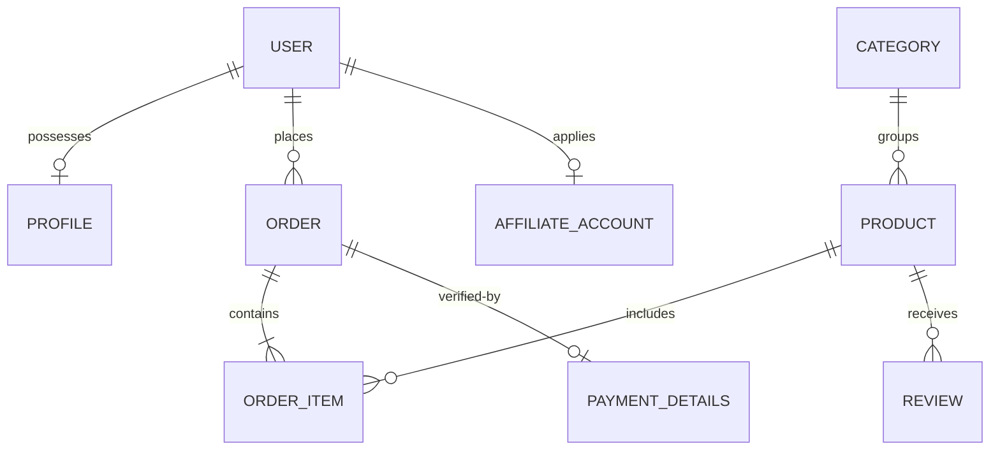

<!-- markdownlint-disable MD013 MD033 -->

# System Architecture - Taybeen Storefront

Detailed overview of routing patterns, rendering pipelines, request sequences, and conceptual schema models for the Taybeen Customer Storefront.

---

## 1. System Context Diagram

The following diagram maps interactions between storefront pages, user session caches, the backend API, and external platforms (Razorpay payment gateway):

---

## 2. Request & Rendering Pipeline

Taybeen leverages Next.js App Router hybrid rendering models to optimize page load speeds (Core Web Vitals) and interactivity:

- **Server Components (RSC)**: Rendered by default for page templates (e.g., `/our-story`, `/shipping-and-delivery`, `/terms-and-conditions`, and products catalog lists) to minimize the clientside JavaScript footprint.
- **Client Components**: Instantiated using the `"use client"` directive for user interactivity components:
  - Cart drawer controller, item counter, and sliding overlay.
  - Interactive product filter panels and image magnifier triggers.
  - Checkout form fields, validation error loops, and loading spinners.
  - Account order visualizers and affiliate sign-up models.

---

## 3. Sequence Diagram: Razorpay Checkout & Order Placement Workflow

This diagram outlines the detailed workflow when a customer completes a purchase using the Razorpay Payment Gateway integration:

---

## 4. Sequence Diagram: Token Authentication & Auto-Refresh Workflow

This diagram details client authentication and the auto-refresh mechanism handled by the Axios client when standard JWT sessions expire:

---

## 5. Data Model ERD (Storefront Conceptual)

Conceptual data entities consumed or updated by pages and contexts in the storefront repository:

---

## 6. Known Limitations & Evolution Paths

- **Context-Bound Cart Storage**: State is managed in a React Context wrapper, triggering recalculations on every context subscriber re-render.
  - _Evolution_: Refactor state storage into Zustand to limit slice updates and boost page responsiveness.
- **Client-side Search Filters**: Product lists resolve search queries and category exclusions in-memory on the client.
  - _Evolution_: Implement paginated API server requests matching search queries to optimize bundle sizing.
- **Payment Verification Fallbacks**: Payment confirmation relies on frontend redirection hooks.
  - _Evolution_: Rely exclusively on backend Stripe/Razorpay server-to-server webhook notifications to handle cases where a customer closes their tab mid-verification.
