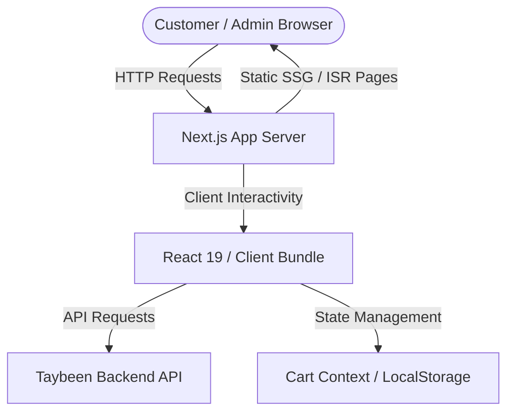
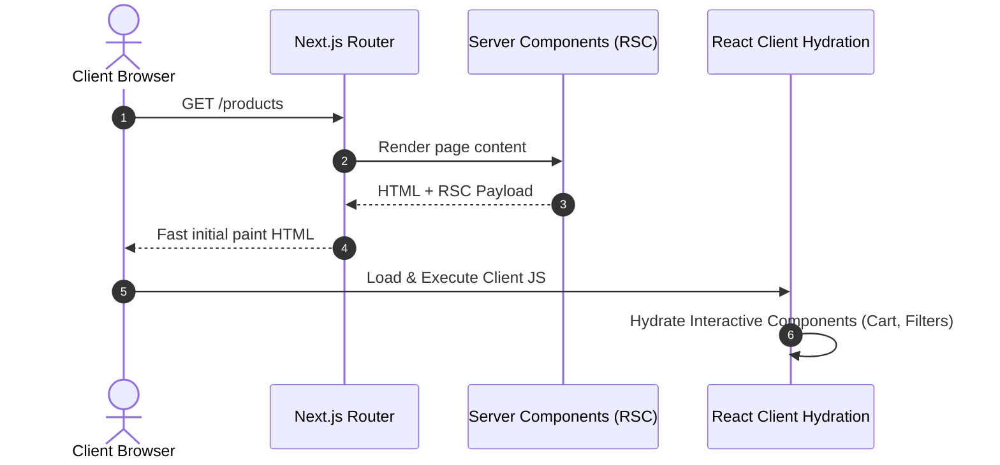
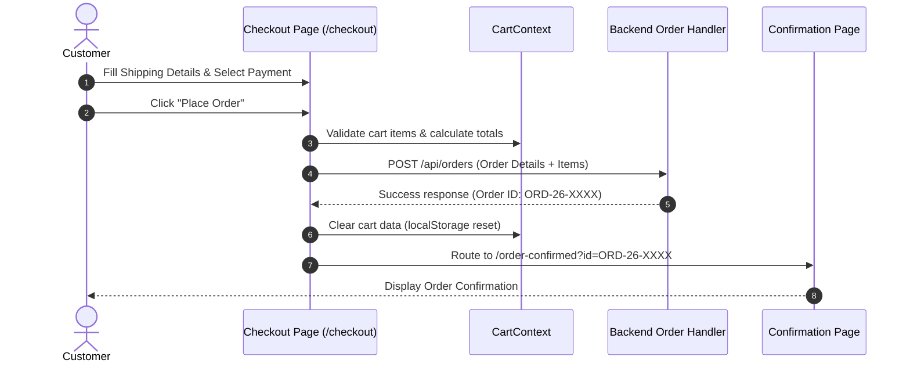
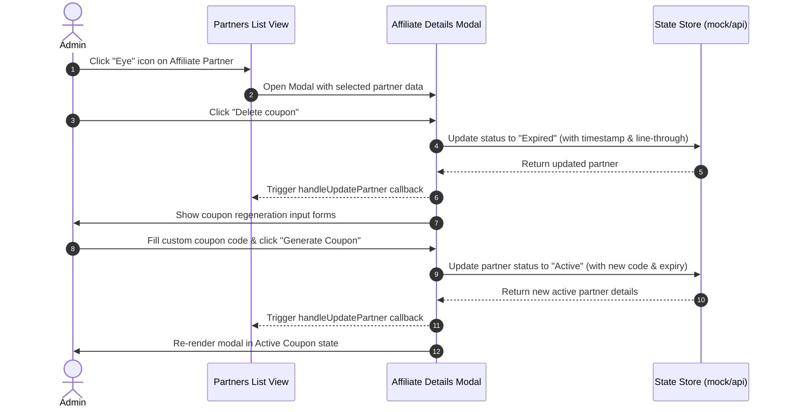
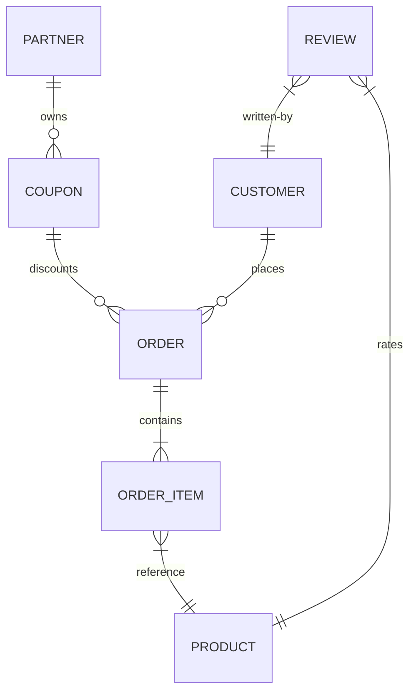

<!-- markdownlint-disable MD013 MD033 -->

# System Architecture - Taybeen Frontend

Detailed overview of routing patterns, rendering pipelines, request sequences, and conceptual schema models.

---

## 1. System Context Diagram

The following diagram maps interactions between storefront pages, administrative settings, and mock databases:

---

## 2. Request & Rendering Pipeline

Taybeen leverages Next.js App Router hybrid rendering models:

- **Server Components (RSC)**: Rendered by default for page templates (e.g., our story, FAQ, catalog overview) to minimize JavaScript sent to browsers.
- **Client Components**: Triggered via `"use client"` directive for interactive views, including:
  - Cart drawers, item modifiers, and sidebar drawers.
  - Admin dashboards, filter inputs, dialog overlays, and form submissions.

---

## 3. Sequence Diagram: Primary Checkout Workflow

The following sequence details the checkout pipeline where a customer places an order:

---

## 4. Sequence Diagram: Admin Coupon Expiry and Regeneration Workflow

Below is the workflow for admin affiliate coupon management (e.g. within [PartnersList](file:///c:/Users/Admin/Desktop/Taybeen/taybeen-frontend/src/components/admin/partners/PartnersList.tsx) and [AffiliateDetailsModal](file:///c:/Users/Admin/Desktop/Taybeen/taybeen-frontend/src/components/admin/partners/AffiliateDetailsModal.tsx)):

---

## 5. Data Model ERD (Conceptual)

Conceptual schema representing the model relationships consumed by the UI:

---

## 6. Known Limitations & Evolution Paths

- **Mock Datastore**: Currently, the dashboard, reviews list, and partner coupon flows run on in-memory React state derived from `/src/data/`.
  - _Evolution_: Replace local data imports with Server Actions or React Query fetching from live database APIs.
- **Clientside Search**: Filters and query terms are resolved in-memory on the client.
  - _Evolution_: Migrate to server-side query params for pagination and database-level fuzzy indexing when catalog count increases.
