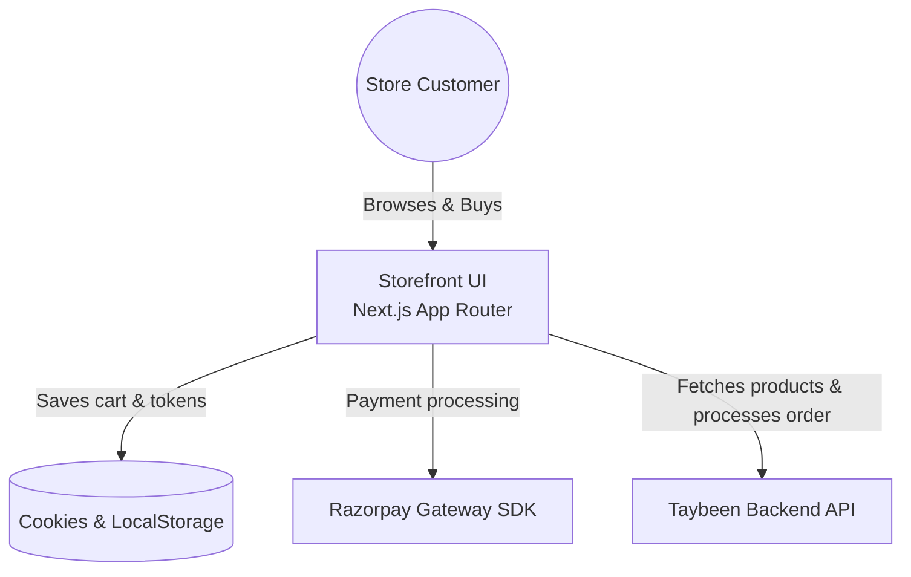

<!-- markdownlint-disable MD013 MD033 -->

# Taybeen - Premium Dates & Gifts Storefront

Premium customer-facing e-commerce storefront for organic dates, gift boxes, and festive hampers.

[](#tech-stack)
[](#tech-stack)
[](#tech-stack)
[](#tech-stack)
[](#quick-start)
[](#tech-stack)
[](LICENSE)
[](#roadmap)

## Overview

Taybeen is a high-end customer-facing e-commerce platform designed for selling premium organic dates (such as Ajwa, Sukkari, and Mebroom), corporate gift boxes, and festive hampers.

This repository containing the `taybeen-frontend` codebase represents **strictly the storefront application**. It includes full user navigation flows, category-based product filters, a responsive shopping cart, a regional checkout process with shipping fee calculators, a comprehensive customer profile dashboard (My Account), product reviews, and affiliate program registration.

Administrative operations (e.g., product updates, order audits, partner approvals) are segregated and run out of the sibling repository: [admin-taybeen](../admin-taybeen).

## Problem Statement

Typical e-commerce platforms intertwine user-facing storefronts with back-office administration systems. This increases the customer-side JavaScript bundles and risks leaking access logic to standard client runtimes.

Taybeen separates these scopes by utilizing two distinct frontend repositories:

1. `taybeen-frontend`: An optimized, fast-loading, highly-styled customer storefront.
2. `admin-taybeen`: A restricted, private portal for team coordination.

The storefront handles customer journeys securely via client cookies and localStorage caching, and links directly to the API endpoint for orders validation and payment orchestration.

## Live Demo

| Item                   | Link                                                  |
| ---------------------- | ----------------------------------------------------- |
| Storefront (Hostinger) | <https://taybeen.com>                                 |
| Source                 | <https://github.com/taybeen-healthy/taybeen-frontend> |

### Seeded Customer Access

To explore customer features (e.g. tracking orders, managing billing configurations, and viewing affiliate commission panels), sign in using the following credentials or create a new account in `/signup`:

| View             | Path      | Email                    | Password       | What You Can Do                                                         |
| ---------------- | --------- | ------------------------ | -------------- | ----------------------------------------------------------------------- |
| Customer Profile | `/signin` | `customer@taybeen.local` | `customer123!` | View order progress charts, adjust addresses, check affiliate dashboard |

---

## Core Features

- **Interactive Product Catalog**: Browse collections (Ajwa, Sukkari, Mebroom, hampers) with dynamic clientside search, price sliders, and weight variation options.
- **Cart Management Drawer**: Add/remove products with instant subtotal and tax recalculations, persisting data in clientside cookies and localStorage caches.
- **Secure Regional Checkout**: Collects shipping and billing lines. Dynamically validates address formats, email details, and phone structures.
- **Razorpay Payment Integration**: Integrated with the Razorpay payment gateway to authorize credit/debit cards, UPI payments, net banking, or choose Cash on Delivery.
- **Customer My Account Dashboard**: Includes order history logs, dynamic shipment step visualizers (Order Received → Processing → On the Way → Delivered), shipping address cards, and a detailed affiliate commission dashboard.
- **Product Reviews & Rating**: Submit ratings and testimonials for dates, gift boxes, and hampers.
- **Affiliate Program Registration**: Application form for partners to register. Once approved, the dashboard displays active discount codes (e.g., `MARYAM10`) and referral tracking logs.
- **Brand Info & Story Pages**: Structured informational routes describing sourcing practices (Our Story, FAQs, Terms, and Shipping/Refund Policies).

---

## Tech Stack

| Layer       | Technology                 | Version         | Purpose                                       |
| ----------- | -------------------------- | --------------- | --------------------------------------------- |
| Frontend    | React                      | 19.2.x          | Component rendering and runtime engine        |
| Frontend    | Next.js (App Router)       | 16.2.x          | Server-Side Rendering (SSR) and routing       |
| Language    | TypeScript                 | 5.4.x           | Static typing and interfaces safety           |
| Styling     | Tailwind CSS               | 3.4.x           | Responsive design and aesthetic system        |
| Iconography | Lucide React & React Icons | 0.378.x / 5.6.x | Interface indicators and standard vectors     |
| Client      | Axios                      | 1.17.x          | HTTP Client with automatic auth token headers |
| Tooling     | Prettier & ESLint          | 3.2.x / 9.19.x  | Consistency linting and format constraints    |
| Package Mgr | pnpm                       | 10.30.0         | High-performance lockfile manager             |

---

## Architecture at a Glance

The storefront acts as a customer interface, relying on React Context for temporary session states and communicating with a decoupled backend API for checkout orchestration:



For sequence details on payment signatures validation, routing structures, and data models, see [ARCHITECTURE.md](ARCHITECTURE.md).

---

## Quick Start

### Prerequisites

- **Node.js**: Version 20.x or higher
- **pnpm**: Version 10+ (`corepack enable && corepack prepare pnpm@latest --activate`)

### Terminal Commands

```bash
# Clone the repository
git clone https://github.com/taybeen-healthy/taybeen-frontend.git
cd taybeen-frontend

# Install dependencies
pnpm install

# Run the project in development mode
pnpm dev
```

The server starts locally at [http://localhost:3000](http://localhost:3000).

---

## Environment Variables

Configure your local environment inside `.env.local` using the keys below:

| Variable              | Required | Default                        | Purpose                                        |
| --------------------- | -------- | ------------------------------ | ---------------------------------------------- |
| `NEXT_PUBLIC_APP_URL` | Yes      | `http://localhost:3000`        | Local or production domain storefront root URL |
| `NEXT_PUBLIC_API_URL` | Yes      | `http://localhost:5000/api/v1` | Sibling Backend API server endpoint            |

---

## Available Scripts

Execute these scripts from the repository root:

| Script         | Command             | Purpose                                                 |
| -------------- | ------------------- | ------------------------------------------------------- |
| `dev`          | `pnpm dev`          | Start development server with Turbopack fast refresh    |
| `build`        | `pnpm build`        | Compile optimized production static assets              |
| `start`        | `pnpm start`        | Serve production build files locally                    |
| `lint`         | `pnpm lint`         | Execute static lint rules check                         |
| `lint:fix`     | `pnpm lint:fix`     | Resolve all fixable syntax and styling lints            |
| `format`       | `pnpm format`       | Auto-format codebase using Prettier                     |
| `format:check` | `pnpm format:check` | Validate formatting compliance                          |
| `typecheck`    | `pnpm typecheck`    | Execute TypeScript compiler verification                |
| `check`        | `pnpm check`        | Pipeline checklist validation (lint, formatting, types) |

---

## Quality Tooling

We enforce codebase health checks via automated git hooks:

- **ESLint**: Verifies react hooks rules, standard variables usage, and TS patterns.
- **Prettier**: Validates indentation, semicolon preferences, and brace styles.
- **Commitlint**: Restricts commits to Conventional Commits syntax.
- **Lint-staged**: Runs lints and formatting only on staged files before commits.
- **GitHub Actions CI**: Formats, lints, and compiles pages on every incoming Pull Request.

---

## Project Structure

```text
taybeen-frontend/
├── .github/
│   └── workflows/ci.yml       # CI build checklist on PR pushes
├── docs/
│   ├── API.md                 # Storefront pages and API reference mapping
│   ├── SETUP.md               # Environment and Razorpay config instructions
│   └── ADRs/
│       └── 0001-frontend-only-architecture.md # Standalone storefront ADR decision
├── public/                    # Image assets, SVG collections, and custom typography fonts
└── src/
    ├── app/                   # App Router pages and structure layouts
    │   └── (store)/           # Storefront routes group (checkout, catalog, pages)
    ├── components/            # Reusable storefront components
    │   ├── layout/            # Navbar, footer, and float contact elements
    │   ├── ui/                # Core primitives (buttons, inputs, sliders, overlays)
    │   └── user/              # Specific user components (cart drawer, account view)
    ├── context/               # React Context Providers (Cart, Toast, Customization)
    ├── data/                  # Mock storefront content (categories, FAQs, story)
    ├── lib/                   # API client configuration and tailwind merge helpers
    ├── styles/                # CSS configuration files
    └── types/                 # Type declaration files for user structures
```

---

## Route Index Summary

| Path             | Access   | Page Component / Purpose                                   |
| ---------------- | -------- | ---------------------------------------------------------- |
| `/`              | Public   | Store homepage, hero banners, special offers, gifting      |
| `/products`      | Public   | Full products catalog grid, filtering, weight toggles      |
| `/checkout`      | Public   | Shipping details entry, billing details, Razorpay payments |
| `/my-account`    | Customer | Order logs, shipment progression tracker, affiliate panel  |
| `/partnerships`  | Public   | Affiliate request registration application form            |
| `/signin`        | Public   | Customer account credential authentication                 |
| `/signup`        | Public   | New user registration                                      |
| `/auth/callback` | Public   | Authentication redirect token-saving receiver              |

For detailed parameters and request payloads, see [docs/API.md](docs/API.md).

---

## Deployment

The application is hosted on **Hostinger** and automatically deploys via Git check-in hooks.

- Ensure `NEXT_PUBLIC_API_URL` is set to the production API server.
- Ensure CORS configurations on the backend allow request pipelines originating from the storefront domain.

---

## Scalability & Performance

- **Optimized Image Processing**: Employs Next.js dynamic image resizing and lazy loading to keep page speed optimal.
- **Segregated Bundles**: Segmented components reduce JavaScript sent to clients.
- **Axios Interceptor**: Axios client automatically captures expired sessions, requests token refresh sequences, and retries failed calls.

---

## Roadmap

- **State Store Migration**: Move local React Context wrappers to Zustand for lighter component bindings.
- **Offline Cart Capabilities**: Cache selected items locally so users retain their selections on network drops.
- **Localization support**: Add multi-language translation bindings (Arabic/English) for storefront assets.
- **Vitest Suite**: Add full automated client components test cases.

---

## Contributing

Review [CONTRIBUTING.md](CONTRIBUTING.md) for Conventional Commits standards and branch naming structures.

---

## License

Released under the [MIT License](LICENSE).
