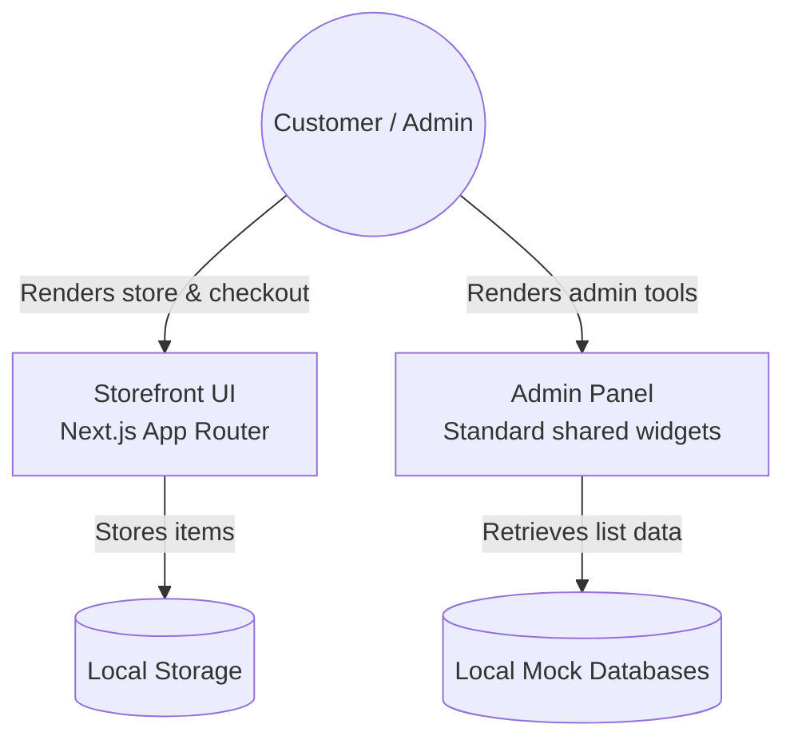

<!-- markdownlint-disable MD013 MD033 -->

# Taybeen - Premium Dates & Gifts Platform

E-commerce storefront and admin dashboard panel for high-quality organic dates, gift boxes, and festive hampers.

[](#tech-stack)
[](#tech-stack)
[](#tech-stack)
[](#tech-stack)
[](#quick-start)
[](#tech-stack)
[](LICENSE)
[](#roadmap)

## Overview

Taybeen is a premium e-commerce platform built for the **Smart Storefront & Admin Dashboard** assignment. Customers browse, filter, and purchase premium dates and corporate gift boxes through an interactive shop and checkout pipeline. Administrators log in to a secure dashboard to manage products catalog, audit customer orders, moderate reviews, configure hero banners, and approve affiliate partners with custom coupon generation/deletion workflows.

## Problem statement

Standard template storefronts separate checkout and administrator management interfaces, making full-lifecycle validation complex. Taybeen models this entire workflow directly in a single repository: interactive cart context state management, checkout with regional shipping validations, role-based admin dashboard portals, responsive data grids, reviews audit controls, and real-time coupon code activation/expiration logic. The codebase is organized as a clean, standardized frontend application with highly reusable administrative layouts.

## Live demo

| Item                    | Link                                                  |
| ----------------------- | ----------------------------------------------------- |
| Storefront (Hostinger)  | <https://taybeen.com>                                 |
| Admin Panel (Hostinger) | <https://taybeen.com/admin>                           |
| Source                  | <https://github.com/taybeen-healthy/taybeen-frontend> |

### Try it — seeded credentials

Use any valid email structure and password to log in to the admin dashboard at <https://taybeen.com/admin/signin>:

| Role  | Email                 | Password    | What you'll see                                              |
| ----- | --------------------- | ----------- | ------------------------------------------------------------ |
| admin | `admin@taybeen.local` | `admin123!` | View statistics, order sheets, and manage affiliate partners |

---

## Core features

### Storefront Customer

- Browse organic collections (Ajwa, Sukkari, Mebroom dates) by categories.
- Cart drawer with real-time price updates and persistent local storage caching.
- Checkout page verifying address lines, postal codes, and payment selection.
- Info pages details (Our Story, FAQs, shipping and refund policies).
- Responsive mobile drawer layout and touch-friendly buttons.

### Admin Dashboard

- **KPI Metrics Overview**: Visualizes total order statistics, pending count, completed totals, and revenue aggregates.
- **Product Management**: Create, edit, and audit dates products catalog with custom dropzone image uploads.
- **Orders Administration**: Search, filter, and track orders; update shipment statuses (Pending → Processing → In Transit → Shipped → Completed → Cancelled).
- **Affiliate & Coupon Generate**: View requests details, reject/approve affiliates, delete existing coupon codes to render them "Expired" (with line-through styling), and generate new codes conditionally.
- **Customization Settings**: Live configurations of homepage hero sections, brand descriptions, and image slots.

---

## Tech stack

| Layer    | Tech                 | Version                               | Purpose                                     |
| -------- | -------------------- | ------------------------------------- | ------------------------------------------- |
| Frontend | React                | 19.2.x                                | View rendering and state component model    |
| Frontend | Next.js (App Router) | 16.2.x                                | Production routing and SSR layout engine    |
| Frontend | TypeScript           | 5.4.x                                 | Strict code type safety                     |
| Frontend | Tailwind CSS         | 3.4.x                                 | Responsive class styles utility             |
| Frontend | Lucide React         | 0.378.0                               | Interface layout icons                      |
| Tooling  | Prettier             | 3.2.x                                 | Formatting rules                            |
| Tooling  | ESLint               | 8.57.x                                | Code syntax checker                         |
| Tooling  | pnpm                 | 10.30.0 (pinned via `packageManager`) | Package manager – single workspace lockfile |

---

## Architecture at a glance



For more in-depth diagrams on request pipelines, ERDs, and the sequence flows, see [ARCHITECTURE.md](ARCHITECTURE.md).

---

## Quick start

### Prerequisites

- Node.js 20+
- pnpm 10+ (`corepack enable && corepack prepare pnpm@latest --activate`)

### Terminal Commands

```bash
# Clone the repository
git clone https://github.com/taybeen-healthy/taybeen-frontend.git
cd taybeen-frontend

# Install dependencies
pnpm install

# Run the project in development mode
pnpm dev
```

Open [http://localhost:3000](http://localhost:3000) for the storefront or [http://localhost:3000/admin](http://localhost:3000/admin) for the admin portal.

---

## Environment variables

Configure your local environment inside `.env.local` based on [.env.example](.env.example):

| Variable              | Required | Default                 | Purpose                                |
| --------------------- | -------- | ----------------------- | -------------------------------------- |
| `NEXT_PUBLIC_APP_URL` | Yes      | `http://localhost:3000` | Storefront application root URL        |
| `NEXT_PUBLIC_API_URL` | No       | `http://localhost:5000` | Future backend connection API endpoint |

---

## Available scripts

Execute these scripts from the repository root:

| Script         | Command             | Purpose                                          |
| -------------- | ------------------- | ------------------------------------------------ |
| `dev`          | `pnpm dev`          | Start dev server with fast refresh               |
| `build`        | `pnpm build`        | Generate optimized production static files       |
| `start`        | `pnpm start`        | Serve built assets locally                       |
| `lint`         | `pnpm lint`         | Execute ESLint validation check                  |
| `lint:fix`     | `pnpm lint:fix`     | Automatically resolve fixable linting issues     |
| `format`       | `pnpm format`       | Format files using Prettier                      |
| `format:check` | `pnpm format:check` | Validate formatting consistency                  |
| `typecheck`    | `pnpm typecheck`    | Execute TypeScript compiler type verification    |
| `check`        | `pnpm check`        | Run linting, format checks, typecheck, and tests |

---

## Quality tooling

We lock code styles via automated pre-checks:

| Tool              | Purpose                                                                  |
| ----------------- | ------------------------------------------------------------------------ |
| ESLint            | Checks react-hooks, accessibility parameters, and TypeScript rules       |
| Prettier          | Unifies brace rules, spacing, and styling in all markdown, css, and json |
| Commitlint        | Enforces Conventional Commits rules on branch messages                   |
| lint-staged       | Restricts formatting checks only to modified staged files                |
| GitHub Actions CI | Build, format, lint, and type check execution on pull requests           |

---

## Project structure

```text
taybeen-frontend/
├─ .github/
│  └─ workflows/ci.yml    GitHub Actions verification setup
├─ docs/
│  ├─ API.md              Storefront and admin routes index
│  ├─ SETUP.md            Clerk & Stripe integration details
│  └─ ADRs/               ADR architectural decisions
├─ public/                Image assets & fonts
├─ src/
│  ├─ app/                App Router page views
│  ├─ components/         UI Components library
│  │  ├─ admin/shared     Reusable admin card widgets, badges, loaders
│  │  ├─ layout/          Navbar, Footer structural zones
│  │  └─ ui/              Storefront core primitives
│  ├─ context/            CartContext state provider
│  ├─ data/               Mock databases for orders, partners, and reviews
│  ├─ lib/                Helper utilities
│  ├─ styles/             Tailwind stylesheet entries
│  ├─ types/              TypeScript type definitions
│  └─ utils/              Form inputs validations
├─ .editorconfig          Code spacing configurations
├─ .gitattributes         Git file property controllers
├─ .gitignore             File checkout ignore rules
├─ .nvmrc                 Node runtime engine pinning
├─ .prettierrc.json       Prettier formatting declarations
├─ commitlint.config.cjs  Conventional commits specification
└─ lint-staged.config.cjs Staged files checking rules
```

---

## API reference

Page Routing reference maps:

| Path              | Protected | Purpose                                              |
| ----------------- | --------- | ---------------------------------------------------- |
| `/`               | No        | Homepage storefront, features, collection highlights |
| `/products`       | No        | Product catalogue filter view                        |
| `/checkout`       | No        | Customer shopping cart checkout address entry        |
| `/admin/signin`   | No        | Admin authentication entry login form                |
| `/admin`          | Yes       | Admin dashboard overview page showing KPI metrics    |
| `/admin/orders`   | Yes       | Orders grid list and status modifiers                |
| `/admin/partners` | Yes       | Affiliate partner validation and coupon generation   |
| `/admin/reviews`  | Yes       | Moderation list panel for product customer reviews   |

Detailed route directories: [docs/API.md](docs/API.md).

---

## Deployment

The application is deployed on **Hostinger** with automatic deployment hooks wired to git branch check-ins.

### Environment checklist

1. Ensure `NEXT_PUBLIC_APP_URL` is set to the live domain URL.
2. Verify all API references and Clerk/Stripe tokens are configured inside Hostinger Dashboard Environment settings.

---

## Scalability considerations

- **Layout Extraction**: The admin dashboard views utilize highly optimized layout shells ([AdminTableShell](file:///c:/Users/Admin/Desktop/Taybeen/taybeen-frontend/src/components/admin/shared/AdminTableShell.tsx), [AdminCard](file:///c:/Users/Admin/Desktop/Taybeen/taybeen-frontend/src/components/admin/shared/AdminCard.tsx)), reducing duplicated CSS bundles.
- **Image Optimization**: Fully supports Next.js image loaders for automatic resizing, lazy loading, and modern format conversions.
- **TypeScript Security**: Strict interfaces lock schema objects, reducing frontend run exceptions.

---

## Roadmap

- **Mock database replacement**: Migrate `/src/data/` collections to real database tables via Prisma/Postgres backend APIs.
- **Stripe Payment Gateway**: Connect checkout pipelines directly to payment gateway verification hooks.
- **State stores transition**: Migrate local React Context states to a centralized Zustand store.
- **Unit Testing Suite**: Add full automated unit tests using Vitest and React Testing Library.

---

## Help wanted

- We welcome first-time setup reviews! Check if [docs/SETUP.md](docs/SETUP.md) provides enough information to install and compile without errors.

---

## Contributing

Review [CONTRIBUTING.md](CONTRIBUTING.md) for Conventional Commits standard rules and [CODE_OF_CONDUCT.md](CODE_OF_CONDUCT.md) for community standard behavior guidelines.

---

## Security

Report vulnerabilities privately per [SECURITY.md](SECURITY.md). Admin UI elements must use portal-safe `z-index` triggers (`z-[100]` for modal dialogues and overlay backdrops) to enforce access barriers.

---

## License

Released under the [MIT License](LICENSE).

---

## Acknowledgements / contact

Built by **Taybeen Team** as an interactive dates and hampers storefront system.

- GitHub: <https://github.com/taybeen-healthy/taybeen-frontend>
- Website: <https://taybeen.com>
